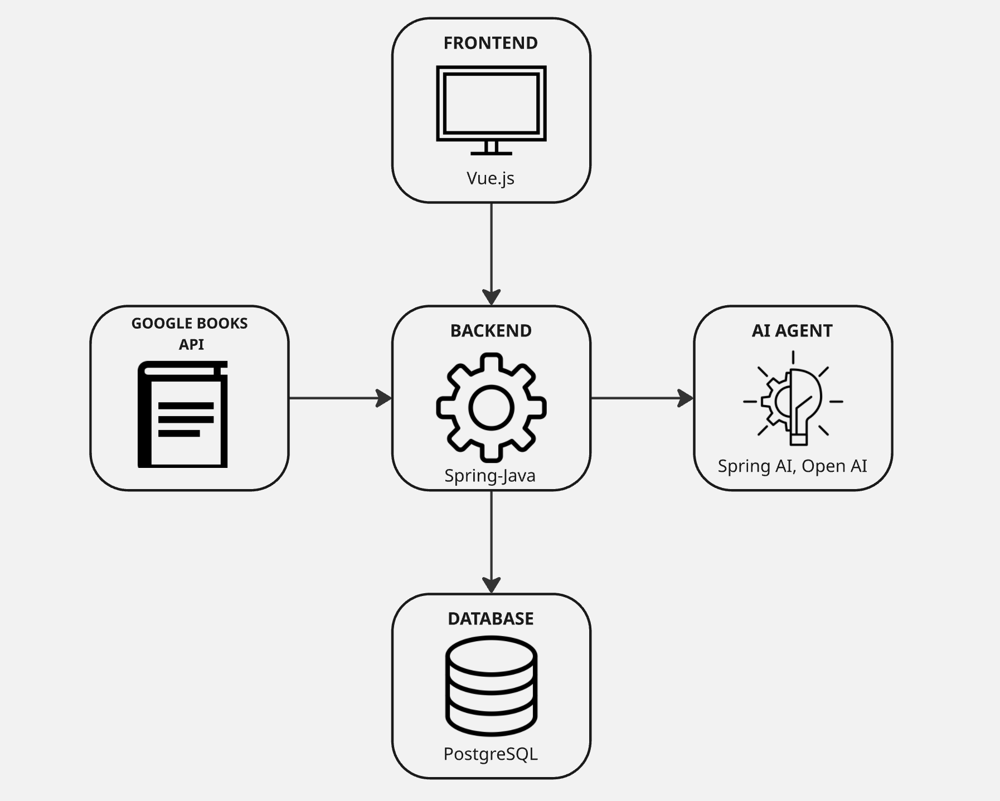
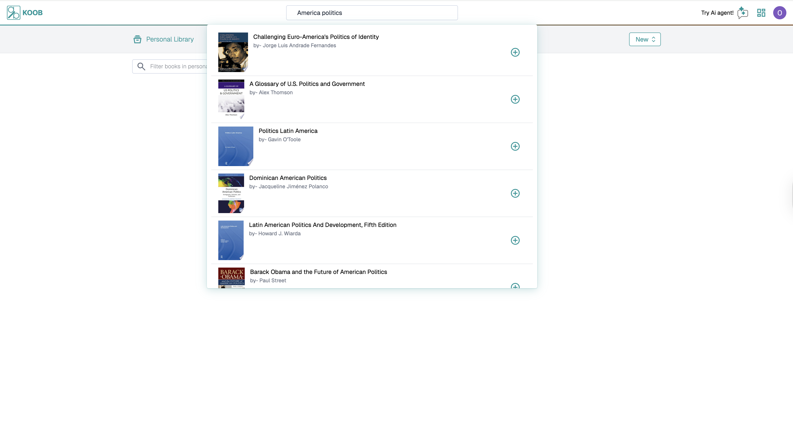
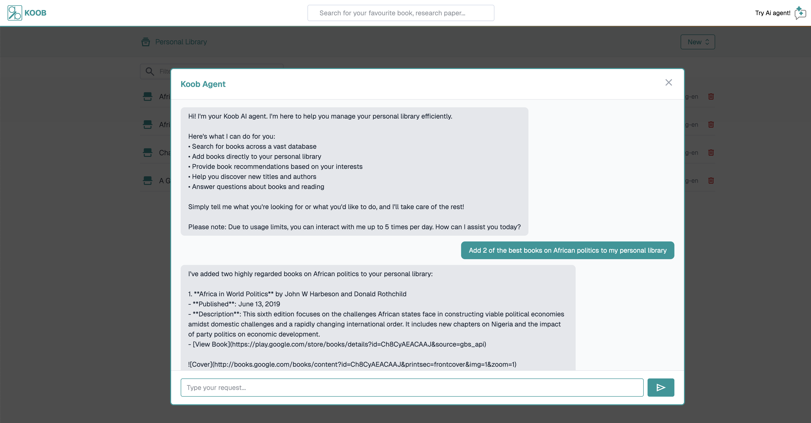

#  Koob Library App — Frontend 
> **An intelligent book and article management system powered by Spring Boot, PostgreSQL, and OpenAI.**

Koob is a full-stack library application that allows users to **search, organize, and manage books and articles** seamlessly.  
The backend, built with **Spring Boot**, integrates the **Google Books API** and an **AI-powered agent** (using **Spring AI** and **OpenAI models**) that understands **natural language commands** like:

> “Find *Deep Learning with Python* and save it to my library.”

🔗 **Backend Repository:** [Koob Backend](https://github.com/scientist-Momi/koob_backend)

---

##  Features

###  Core Functionality
-  **Google Books API Integration** — Seamless search and import of book and article metadata.  
-  **Personal Library Management** — Store and organize books and articles for later access.  
-  **PostgreSQL Database** — Optimized for high-performance retrieval and efficient metadata management.  
-  **Rate Limiting** — Implemented with **Bucket4j** for scalable traffic control and fair resource allocation.

###  AI Agent
-  Built using **Spring AI** and **OpenAI GPT models**.  
-  Understands **natural language commands** and performs contextual actions (search, save, recommend).  
-  Integrates **prompt engineering** for accuracy and intent awareness.

###  Smart Recommendations
-  Suggests personalized books and articles based on user interests and reading patterns.

###  Deployment & DevOps
-  **Heroku Cloud** for backend deployment.  
-  **Cloudflare Pages** for frontend hosting.  
-  **Git-based CI/CD pipelines** for automated deployment and updates.

---

##  Architecture Overview

**System Components:**
1. **Frontend:** Vue.js (deployed via Cloudflare Pages)  
2. **Backend:** Spring Boot REST API  
3. **Database:** PostgreSQL  
4. **AI Layer:** Spring AI + OpenAI GPT  
5. **External Service:** Google Books API  

---

##  Visuals

###  Book Search Response

###  AI Agent Query and Response

---

##  Try App

[Koob App](https://koob.oolumomi.dev)